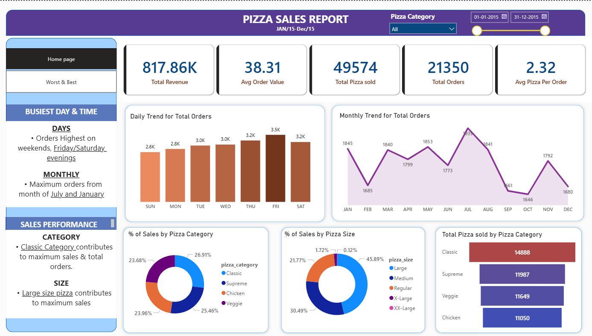
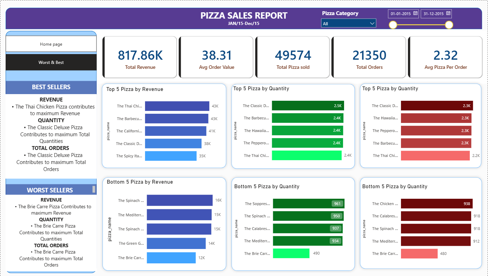

# 🍕 Pizza Sales Dashboard

## Project Overview

This project analyzes pizza sales data using SQL and Power BI.

The dashboard provides insights into:

- Total Revenue
- Average Order Value
- Total Orders
- Total Pizzas Sold
- Daily Sales Trends
- Hourly Sales Trends
- Sales by Category
- Sales by Size
- Top 5 Best Sellers
- Bottom 5 Sellers

---

## Tools Used

- SQL Server
- Power BI
- DAX
- Excel / CSV

---

## Key Insights

- Total Revenue: $817K+
- Total Orders: 21,350
- Total Pizzas Sold: 49,574
- Average Order Value: $38.31

---

## Dashboard Preview

### Main Dashboard

### Sales Trends

---

## Files Included

- pizza_dashboard.pbix
- SQLQuery1.sql
- SQL_query_pizza_sales.docx
- Dataset
